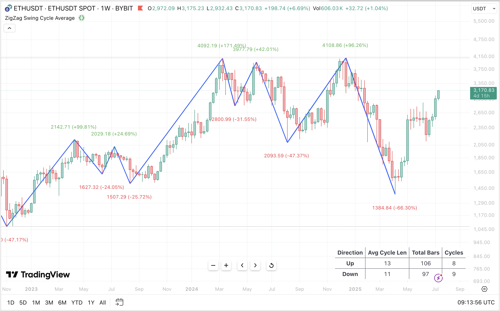

# ZigZag swing cycle average length

[The script](./zigzag-swing-cycle-avg-length.pine)

## OVERVIEW

This indicator calculates the average number of bars in upward and downward trends, based on ZigZag pivot logic. It uses [TradingView’s official ZigZag library](https://www.tradingview.com/script/bzIRuGXC-ZigZag) to identify significant turning points and isolates completed legs to measure trend durations. An on-chart table displays average trend length, total bars, and pivot count.

## CONCEPTS

The ZigZag indicator highlights major price swings by filtering out minor fluctuations and drawing lines between alternating highs and lows (pivots). This script measures the bar distance between these pivots to estimate how long uptrends and downtrends typically last.

The current in-progress leg is disabled by-default which avoids forward-looking bias.

Traders can use this data to:

- Understand the typical duration of bullish vs. bearish moves
- Evaluate whether a trend is extended or premature
- Build time-aware entries or exits based on historical pattern lengths.

## Example

